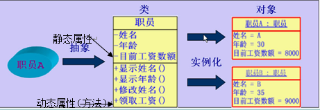

## Python 面向对象

### 面向过程的思想与面向对象的思想
1. 面向过程的思维：当你拿到一个问题，你分析这个问题是第一步先做什么，第二步再做什么
2. 面向对象的思维：你应该分析这个问题里面有哪些类和对象，再分析这些类和对象应该具有哪些属性和方法，最后分析类和类之间具体有什么关系

### 面向对象的设计思想

1. 面向对象的基本思想是，从现实世界中客观存在的事物出发来构造软件系统，并在系统的构造中尽可能运用人类的自然思维方式。
2. 面向对象更加强调运用人类在日常生活的逻辑思维中经常采用的思想方法与原则，如抽象、分类，继承、聚合、多态等。

### 对象和类的概念

1. 对象是用于计算机语言对问题域中事物的描述，对象通过“属性（attribute）”和“方法（method）”来分别对应事物所具有的静态属性和动态属性。
2. 类是用于描述同一类的对象的一个抽象的概念，类中定义了这一类对象所具有的静态属性和动态属性



### Python面向对象

#### 创建类
1. 使用 class 语句来创建一个新类，class 之后为类的名称并以冒号结尾
2. Python类中的方法与普通的函数只有一个特别的区别——它们必须有一个额外的第一个参数名称, 按照惯例它的名称是 self，其中self代表的是类的实例，即当前对象
```
class Person(object):
	"""This class is designed to describe a person
	
	Detail information

	:param sex: user sex, man or woman
	:param age: user age
	"""
	
	def __init__(self, sex, age):
		self.sex = sex
		self.age = age

	def user_age(self):
		return self.age
	
	@staticmethod 
	def desc():
		return Person.__doc__
```

#### 创建实例对象
实例化类其他编程语言中一般用关键字 new，但是在 Python 中并没有这个关键字，类的实例化类似函数调用方式。
以下使用类的名称 Person来实例化，并通过 __init__ 方法接收参数
```
person1 = Person("man", 20)
person2 = Person("woman", 19)
```

#### 访问属性
通常使用点号 . 来访问对象的属性。使用如下类的名称访问类变量:
```
person1 = Person("man", 20)

person1.age
person1.sex
```

#### 属性的高级访问方法
1.  getattr(obj, name[, default]) : 访问对象的属性。
2.  hasattr(obj,name) : 检查是否存在一个属性。
3.  setattr(obj,name,value) : 设置一个属性。如果属性不存在，会创建一个新属性。
4.  delattr(obj, name) : 删除属性。

#### 类的内置属性（仅Python）
1. \__dict__: 类的属性 （包含一个字典，由类的数据属性组成）
2. \__doc__: 类的文档字符串
3. \__name__:  类名
4. \__module\__: 类定义所在的模块（类的全名是'\__main\__.className'，如果类位于一个导入模块mymod中，那么className.\__module__ 等于 mymod）
5. \__bases__ : 类的所有父类构成元素（包含了一个由所有父类组成的元组）
6. 析构函数 \__del__ ，\__del__在对象销毁的时候被调用，当对象不再被使用时


#### property属性
property是一种特殊的属性，访问它时会执行一段功能（函数）然后返回值。将一个类的函数定义成特性以后，对象再去使用的时候obj.name,根本无法察觉自己的name是执行了一个函数然后计算出来的

注意：此时的特性arear不能被赋值
```
 import math
 class Circle:
     def __init__(self,radius): #圆的半径radius
         self.radius=radius
 
     @property
     def area(self):
         return math.pi * self.radius**2 #计算面积

	@area.setter
	def area(self,value):
	     self.__NAME=value #通过类型检查后,将值value存放到真实的位置self.__NAME

	@area.getter
	def area():
		return self.radius
```

#### staticemethod方法
通常情况下，在类中定义的所有函数都是对象的绑定方法，对象在调用绑定方法时会自动将自己作为参数传递给方法的第一个参数。除此之外还有两种常见的方法：静态方法和类方法，二者是为类量身定制的，但是实例非要使用，也不会报错。

静态方法是一种普通函数，位于类定义的命名空间中，不会对任何实例类型进行操作，python为我们内置了函数staticmethod来把类中的函数定义成静态方法

应用场景: 编写类时需要采用很多不同的方式来创建实例，而我们只有一个__init__函数，此时静态方法就派上用场了
```
class Date:
    def __init__(self,year,month,day):
        self.year=year
        self.month=month
        self.day=day
        
    @staticmethod
    def now():                                     # 用Date.now()的形式去产生实例,该实例用的是当前时间
        t=time.localtime()                         # 获取结构化的时间格式
        return Date(t.tm_year,t.tm_mon,t.tm_mday)  # 新建实例并且返回
        
    @staticmethod
    def tomorrow():                                # 用Date.tomorrow()的形式去产生实例,
        t=time.localtime(time.time()+86400)
        return Date(t.tm_year,t.tm_mon,t.tm_mday)
```

#### classmethod类方法
类方法是给类用的，类在使用时会将类本身当做参数传给类方法的第一个参数，python为我们内置了函数classmethod来把类中的函数定义成类方法
```
class Person(object):
    
    count = 1
    
    @classmethod
    def test(cls):
        print(cls, cls.count)
```

注意注意注意：静态方法和类方法虽然是给类准备的，但是如果实例去用，也是可以用的，只不过实例去调用的时候容易让人混淆，不知道你要干啥


#### 类的继承
通过继承创建的新类称为子类或派生类，被继承的类称为基类、父类或超类。
在python中继承中的一些特点：
1.  如果在子类中需要父类的构造方法就需要显示的调用父类的构造方法，或者不重写父类的构造方法。详细说明可查看：python 子类继承父类构造函数说明。
2.  在调用基类的方法时，需要加上基类的类名前缀，且需要带上 self 参数变量。区别在于类中调用普通函数时并不需要带上 self 参数
3.  Python 总是首先查找对应类型的方法，如果它不能在派生类中找到对应的方法，它才开始到基类中逐个查找。（先在本类中查找调用的方法，找不到才去基类中找）。
```
class Parent(object):        
  
   parent_attr = 100
	  
   def __init__(self):
      print "调用父类构造函数"
 
   def parent_method(self):
      print '调用父类方法'
 
   def set_attr(self, attr):
      Parent.parent_attr = attr
 
   def get_attr(self):
      print "父类属性 :", Parent.parent_attr
 
class Child(Parent): # 定义子类
   def __init__(self):
      print "调用子类构造方法"
 
   def child_method(self):
      print '调用子类方法'

c = Child()          # 实例化子类
c.child_method()      # 调用子类的方法
c.parent_method()     # 调用父类方法
c.set_attr(200)       # 再次调用父类的方法 - 设置属性值
c.get_attr()          # 再次调用父类的方法 - 获取属性值
```

#### 多重继承
如果在继承元组中列了一个以上的类，那么它就被称作"多重继承" 。

```
class Child(Parent, Student):	
	pass
```

#### 重载构造方法
如果子类和父类都有构造函数，子类其实是重写了父类的构造函数，如果不显式调用父类构造函数，父类的构造函数就不会被执行
为了达到预期的效果，子类的构造方法必须调用其父类的构造方法来进行基本的初始化
```

class Person(object):
	
	def __init__(self, sex, age):
		self.sex = sex
		self.age = age

class Student(Person):
	
	# 方法一
	def __init__(self, sex, age, school):
		Person.__init__(self, sex, age)
		self.school = school


class Student(Person):
	
	# 方法二
	def __init__(self, sex, age, school):
		super(Student, self).__init__(sex, age)
		self.school = school
	
```

特点： 方法一更直观，方法二可以一次初始化所有超类
小结：[https://blog.csdn.net/seizef/article/details/5310107](https://blog.csdn.net/seizef/article/details/5310107)
1. super并不是一个函数，是一个类名，形如super(B, self)事实上调用了super类的初始化函数， 产生了一个super对象；
2. super类的初始化函数并没有做什么特殊的操作，只是简单记录了类类型和具体实例；
3. super(B, self).func的调用并不是用于调用当前类的父类的func函数；
4. Python的多继承类是通过MRO（Method Resolution Order）的方式来保证各个父类的函数被逐一调用，而且保证每个父类函数只调用一次（如果每个类都使用super）；
5. 混用super类和非绑定的函数是一个危险行为，这可能导致应该调用的父类函数没有调用或者一 个父类函数被调用多次。


#### 类属性与方法
1. 类的私有属性
\__private_attrs:  两个下划线开头，声明该属性为私有，不能在类的外部被使用或直接访问。在类内部的方法中使用时 self.\__private_attrs

2. 类的方法
在类的内部，使用 def 关键字可以为类定义一个方法，与一般函数定义不同，类方法必须包含参数 self,且为第一个参数

3. 类的私有方法
\__private_method：两个下划线开头，声明该方法为私有方法，不能在类的外部调用。在类的内部调用 self.\__private_methods

#### 实例属性和类属性
当我们定义了一个类属性后，这个属性虽然归类所有，但类的所有实例都可以访问到
```
class Student(object):
	name = "Student"

>>> s = Student()       # 创建实例
>>> print(s.name)       # 打印name属性，因为实例并没有name属性，所以会继续查找class的name属性
Student
>>> print(Student.name) # 打印类的name属性
Student
>>> s.name = "ZhangSan" # 给实例绑定name属性
>>> print(s.name)       # 由于实例属性优先级比类属性高，因此，它会屏蔽掉类的name属性
Zhangsan
>>> print(Student.name) # 但是类属性并未消失，用Student.name仍然可以访问
Student
>>> del s               # 如果删除实例的name属性
>>> print(s.name)       # 再次调用s.name，由于实例的name属性没有找到，类的name属性就显示出来了
Student
```
总结：在实例中访问一个属性，但是实例中没有，就试图去类中寻找这个属性。找到了，就有，没找到，就抛出异常。当试图用实例去修改一个在类中不可变的属性的时候，实际上并没有修改，而是在实例中创建了这个属性。当再次访问这个属性时，就不用去类中寻找了

#### 单下划线、双下划线、头尾双下划线说明
1. \__foo__  : 定义的是特殊方法，一般是系统定义名字 ，类似 __init__() 之类的。
2. _foo: 以单下划线开头的表示的是 protected 类型的变量，即保护类型只能允许其本身与子类进行访问，不能用于 from module import *
3. __foo: 双下划线的表示的是私有类型(private)的变量, 只能是允许这个类本身进行访问了。


```

class Response(object):
    """The :class:`Response <Response>` object, which contains a
    server's response to an HTTP request.
    """

    __attrs__ = [
        '_content', 'status_code', 'headers', 'url', 'history',
        'encoding', 'reason', 'cookies', 'elapsed', 'request'
    ]

    def __init__(self):
        self._content = False
        self._content_consumed = False
        self._next = None

     @property
    def is_redirect(self):
        """True if this Response is a well-formed HTTP redirect that could have
        been processed automatically (by :meth:`Session.resolve_redirects`).
        """
        return ('location' in self.headers and self.status_code in REDIRECT_STATI)

    def close(self):
        """Releases the connection back to the pool. Once this method has been
        called the underlying ``raw`` object must not be accessed again.

        *Note: Should not normally need to be called explicitly.*
        """
        pass
  
  class JsonResponse(Response):
	  
	  @staticmethod
	  def to_json():
		  """Releases the connection back to the pool. 
		  Once this method has been called the underlying ``raw`` object must not be accessed again.
	      *Note: Should not normally need to be called explicitly.*
	      """
		  return xxx
```

